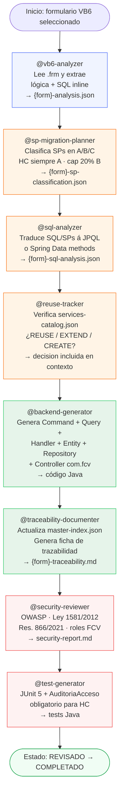
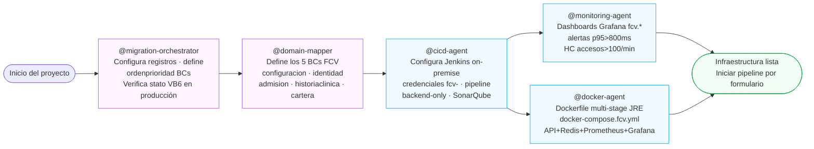
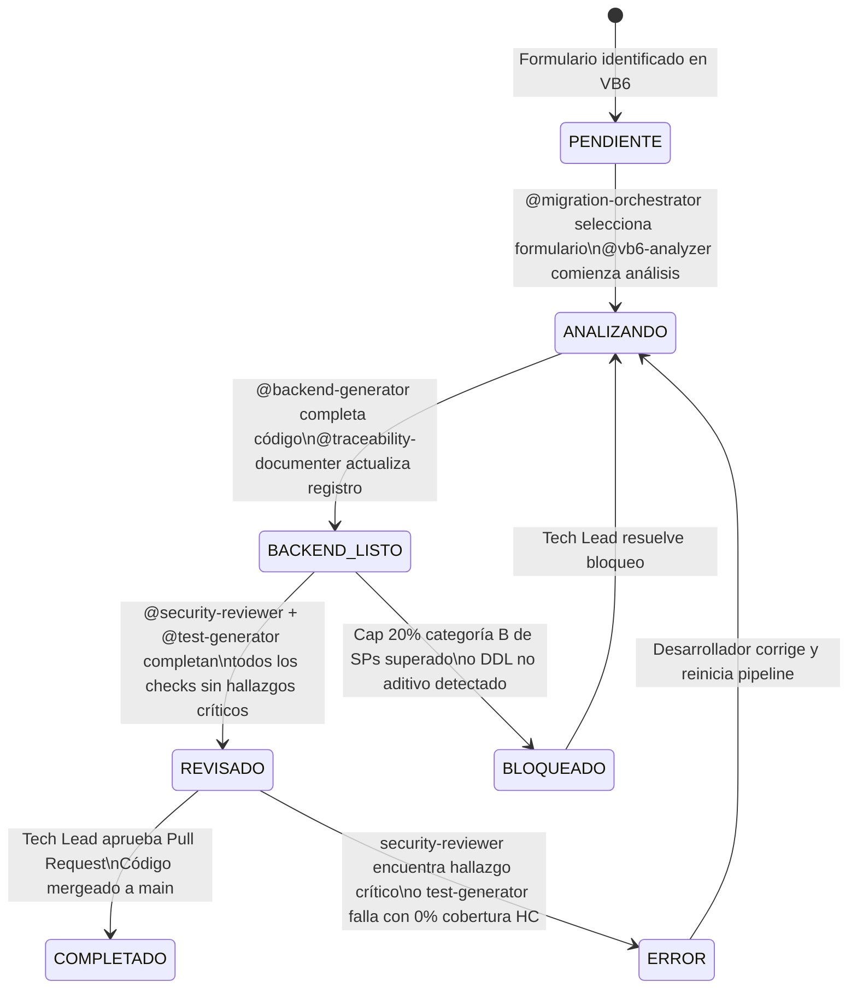

# Orden de Ejecución de Agentes — FCV Backend

**Proyecto:** Fundación Cardiovascular — Migración VB6 → Java 21 Spring Boot  
**Alcance:** Solo backend `com.fcv` — Fase 1  
**Patrón:** Strangler Fig incremental, formulario por formulario

---

## Flujo Principal — Pipeline por Formulario VB6



---

## Flujo de Agentes de Infraestructura (una sola vez, al inicio)



---

## Flujo de Estados del Master-Index



---

## Dependencias entre Agentes

| Agente | Requiere que estén completos | Puede correr en paralelo con |
|--------|------------------------------|------------------------------|
| `@vb6-analyzer` | — (primer paso) | Otros formularios del mismo BC |
| `@sp-migration-planner` | `@vb6-analyzer` del mismo formulario | — |
| `@sql-analyzer` | `@sp-migration-planner` del mismo formulario | — |
| `@domain-mapper` | `@vb6-analyzer` (para confirmar BC) | `@sql-analyzer` |
| `@reuse-tracker` | `@sql-analyzer` del mismo formulario | — |
| `@backend-generator` | `@reuse-tracker` + `@domain-mapper` completos | — |
| `@traceability-documenter` | `@backend-generator` del mismo formulario | — |
| `@security-reviewer` | `@traceability-documenter` del mismo formulario | `@test-generator` |
| `@test-generator` | `@backend-generator` del mismo formulario | `@security-reviewer` |
| `@cicd-agent` | `@domain-mapper` (estructura de módulos definida) | `@monitoring-agent`, `@docker-agent` |
| `@monitoring-agent` | `@domain-mapper` (BCs definidos para dashboards) | `@cicd-agent`, `@docker-agent` |
| `@docker-agent` | `architecture-context.json` disponible | `@cicd-agent`, `@monitoring-agent` |

---

## Orden Recomendado de Bounded Contexts

Ejecutar formularios en este orden para minimizar dependencias entre módulos:

```
1. configuracion   → Catálogos maestros. Sin dependencias. Habilita CUPs, CIEs, EPS para los demás.
2. identidad       → Usuarios, roles, AuditoriaAcceso. Todos los demás BCs dependen de identidad.
3. admision        → Paciente, Atencion, Cita, CamaMovimiento. ~40 formularios, mayor volumen.
4. historiaclinica → HC, EventoClinico, Certificados. Regulación más estricta (Res. 866/2021).
5. cartera         → Factura, Cobro. Requiere admision completo.
```

---

## Reglas de Ejecución Críticas

| Regla | Detalle |
|-------|---------|
| **HC siempre A** | Formularios `frmHC*` → todos sus SPs son Categoría A. `@sp-migration-planner` no puede clasificarlos como B o C. |
| **Cap 20% Cat B** | Si el módulo supera el 20% de SPs en Categoría B → BLOQUEADO, requiere decisión del Tech Lead. |
| **DDL solo aditivo** | `@backend-generator` nunca genera `DROP TABLE`, `ALTER TABLE DROP COLUMN`, ni `ALTER COLUMN`. Si es necesario → BLOQUEADO. |
| **AuditoriaAcceso antes de devolver HC** | Todo endpoint que devuelva datos de historia clínica debe registrar en `AuditoriaAcceso` ANTES de retornar la respuesta. `@security-reviewer` valida esto. |
| **Consultar services-catalog.json primero** | `@reuse-tracker` siempre verifica `migration-registry/services-catalog.json` antes de generar. Si el servicio existe → REUSE, no CREATE. |
| **Domain Event al completar Command** | `@backend-generator` publica un Domain Event al final de cada CommandHandler exitoso. |
| **Tests de AuditoriaAcceso obligatorios** | Para cualquier formulario del módulo `historiaclinica`, `@test-generator` DEBE generar el test de verificación de auditoría. Sin este test → no se puede marcar REVISADO. |

---

## Skills Activos por Fase

```
ANALIZANDO:
  > backend/ddd-patterns.skill.md      → @vb6-analyzer, @domain-mapper
  > data/sql-to-jpql.skill.md          → @sp-migration-planner, @sql-analyzer  
  > backend/jpa-patterns.skill.md      → @sp-migration-planner, @sql-analyzer

BACKEND_LISTO:
  > backend/ddd-patterns.skill.md      → @backend-generator
  > backend/cqrs-patterns.skill.md     → @backend-generator
  > backend/jpa-patterns.skill.md      → @backend-generator
  > backend/exception-handling.skill.md → @backend-generator
  > architecture/modular-monolith-patterns.skill.md → @backend-generator, @reuse-tracker
  > architecture/adr-patterns.skill.md → @domain-mapper

REVISADO:
  > quality/security-checklist.skill.md → @security-reviewer
  > backend/spring-security.skill.md    → @security-reviewer
  > quality/test-patterns.skill.md      → @test-generator

INFRAESTRUCTURA:
  > infra/docker-patterns.skill.md     → @docker-agent, @cicd-agent
```
